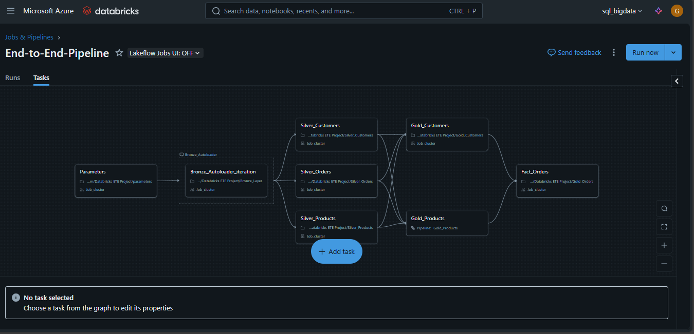

**Source**: https://youtu.be/4uKRzDf0zIc?si=muu7IGbi3VB7-1Bw
This project highlighted the seamless integration of Azure Databricks’ diverse capabilities.

## Topics covered:
- Project Architecture
- Azure & Databricks Setup
- Unity Catalog
- Ingestion
- Autoloader
- Spark Structured Streaming
- ETL job
- Pyspark functions
- SCD with pyspark
- DLT
- Star Schema
- Run pipeline
