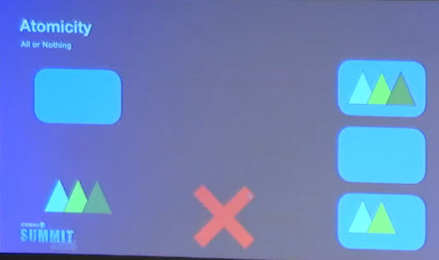
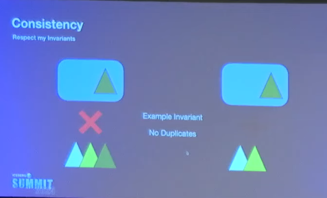
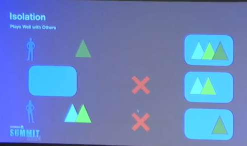
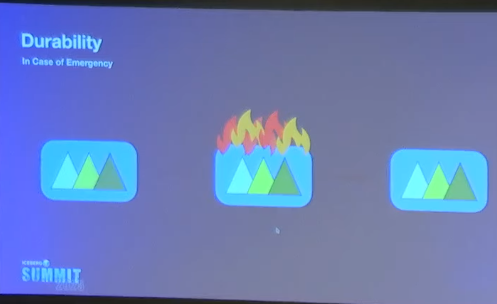
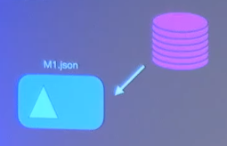
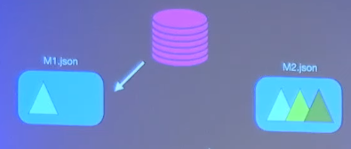
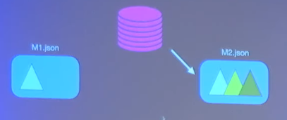
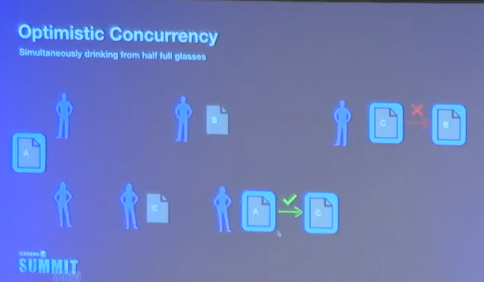
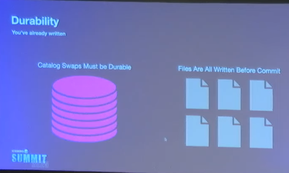

# Transactions and Isolation in Apache Iceberg™
[Video Link](https://youtu.be/zhxw3Rrslak?si=MybbQf-ZeTbFW3EF)
by Russell Spitzer (Iceberg & Polaris PMC)
- this video is a bit on the technical side.

## ACID
### Atomicity
All or nothing

### Consistency
Respect my invariants (rules)

### Isolation
Play well with others

### Durability
In case of emergencies

## Iceberg Specification
[Spec Link](https://iceberg.apache.org/view-spec/#overview)

### Atomicity in iceberg
A check and swap

### Optimistic Concurrency and Durability

- concurrency: no lock. 2 users can write on the same state at the same time without blocking each other. The only part that needs sync is "commit"

- actual data is already written. Commit is just a pointer swap.

### Iceberg consistency validation
In "optimistic" system, conflicts are inevitable.
What happens in retries if a commit fails: Validation and it comes with different difficulty level.

| Operation             | Difficulty | Why?                                                                                                                 |
|-----------------------|------------|----------------------------------------------------------------------------------------------------------------------|
| Fast Append           | Easy       | You're just adding new data. It doesn't matter what else happened to the table; your new data is still new.          |                                                                                                  |
| Streaming Delete      | Medium     | "You are removing specific files. You have to check: ""Does the file I’m trying to delete still exist, or did someone else already delete it?"""                                                        |
| Rewrite Data Files    | Hard       | "Used for compaction. You must ensure that while you were combining small files into big ones, no one changed the actual rows inside them. You can't accidentally ""resurrect"" a deleted row." |
| Row Delta / Overwrite | Critical   | "These are UPDATE or MERGE commands. They have ""semantic"" requirements—if you're updating everyone's salary by 10%, you have to be sure the salaries didn't change while you were calculating."                      |

### Key takeaway of this vid
If you take away only one thing from this entire talk, let it be this:
Data Lakes (like Iceberg) allow many people to work on the same data at once without locking each other out. They do this by being "optimistic," but they have a strict set of "validation rules" at the very end to make sure nobody accidentally overwrites or misses someone else's work.

